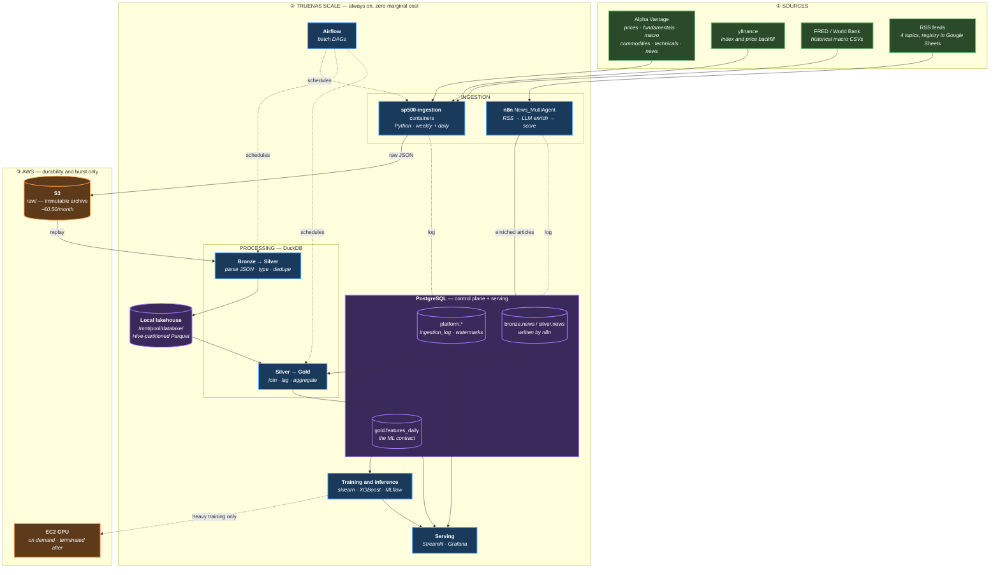

# AI_SP500 — Architecture v0.2

**Status:** target architecture · supersedes `InfaArquitecture_V0.1.png`
**Date:** 2026-08-01

---

## Table of Contents

- [1. Why v0.1 was replaced](#1-why-v01-was-replaced)
- [2. Design principles](#2-design-principles)
- [3. The architecture](#3-the-architecture)
- [4. Layer by layer](#4-layer-by-layer)
- [5. Storage layout](#5-storage-layout)
- [6. Database schema](#6-database-schema)
- [7. Integrating the n8n news pipeline](#7-integrating-the-n8n-news-pipeline)
- [8. Ingestion budget](#8-ingestion-budget)
- [9. Point-in-time correctness](#9-point-in-time-correctness)
- [10. Cost model](#10-cost-model)
- [11. Next steps](#11-next-steps)
- [12. Deliberately deferred](#12-deliberately-deferred)

---

## 1. Why v0.1 was replaced

The v0.1 diagram is a well-drawn *enterprise* architecture. That is precisely the problem: every component is sized for a data volume and a team that this project does not have.

| v0.1 component | Why it was cut |
|---|---|
| **Apache Spark on EC2** | Spark's value is distributing work across a cluster. This platform's daily increment is single-digit megabytes of JSON. A DuckDB query on one TrueNAS core will finish before a Spark session finishes starting — and Spark's JVM tuning, cluster config and EC2 bill are permanent overhead. |
| **Delta Lake** | Buys ACID transactions, time travel and concurrent-writer safety. There is exactly one writer here, and raw data is immutable and already versioned by its S3 path. Requires either Spark or `delta-rs` — a hard dependency bought for benefits that do not apply. |
| **Unity Catalog** | A governance and access-control product for organisations with many users, workspaces and permission boundaries. This platform has one user. It cannot be self-hosted meaningfully outside Databricks. Pure cost, zero benefit. |
| **Amazon Aurora** | A second, paid, managed database — while a perfectly good PostgreSQL already runs 24/7 on TrueNAS and is already trusted with the n8n news data. Adding Aurora also splits the news feed from the market feed across two engines, making the single most valuable join in the project a cross-database problem. |
| **Always-on EC2** (orchestration + AI/ML) | ~€40–120/month for compute that is idle >95% of the time, duplicating a home server that is already powered on. |
| **`postgres-logging` container** | `DataIngestion/docker-compose.yaml` spins up a *third* Postgres on port 5433. Three databases, three places to look when a pipeline breaks. |

**What v0.1 got right and v0.2 keeps:** the medallion (Bronze/Silver/Gold) model, Parquet as the storage format, S3 as the durable raw landing zone, n8n as the ingestion workhorse, Airflow as the batch orchestrator, and a clean separation between storage and serving.

**What v0.1 under-modelled:** the n8n pipeline is drawn as a generic ingestion box. In reality it already performs LLM enrichment and writes its own Bronze and Silver tables — it is a full pipeline, and the most mature one in the estate. v0.2 promotes it to a first-class feed.

---

## 2. Design principles

1. **TrueNAS is the platform. S3 is the archive. EC2 is a rented burst.**
   The server is on 24/7 regardless; its marginal cost per workload is zero.
2. **Right-size the engine to the data.** Megabytes per day → DuckDB, not Spark.
3. **Raw is immutable.** Every downstream layer is reproducible by replaying `raw/`.
4. **One control plane.** Python feeds and n8n feeds log to the same table, so one query answers "is the platform healthy?".
5. **Point-in-time correctness is a hard requirement**, not a later refinement. See [§9](#9-point-in-time-correctness).
6. **Configuration over code.** New endpoints are JSON entries.
7. **Every layer must be independently runnable.** No step may require Airflow to be up in order to be tested.

---

## 3. The architecture



### The one-sentence version

Two ingestion feeds — Python→S3 for market data, n8n→Postgres for news — converge in a DuckDB-powered local lakehouse on TrueNAS, which produces a single point-in-time-correct `gold.features_daily` table that is the only contract the ML layer depends on.

---

## 4. Layer by layer

### ① Sources

Unchanged from today, with one addition: **yfinance for price backfill**. Alpha Vantage's free tier cannot economically backfill 20 years of daily prices for 500 tickers; yfinance can, in minutes, for free. Use Alpha Vantage for what it is uniquely good at — fundamentals, macro series, news sentiment — and yfinance for bulk price history.

### ② Ingestion — TrueNAS

Two feeds, deliberately kept separate because they have genuinely different shapes:

**Python containers** handle structured REST APIs where the job is *fetch, don't interpret*. Raw response goes to S3 byte-for-byte. Enrichment happens later, in a layer that can be re-run.

**n8n** handles RSS and agentic enrichment, where the job needs LLM calls, retries, tool use and human-legible workflow editing. This is genuinely what n8n is best at, and the existing workflow already works. Do not rewrite it in Python.

The contract between them: **both write a row to `platform.ingestion_log` for every unit of work.**

### ③ Storage — three tiers, each with one job

| Tier | Location | Holds | Why here |
|---|---|---|---|
| **Raw archive** | S3 `raw/` | Untouched API responses, forever | Off-site, durable, cheap, immutable. The disaster-recovery boundary. |
| **Lakehouse** | TrueNAS `/mnt/pool/datalake/` | Silver + Gold Parquet | Free, fast, no egress charges. Fully rebuildable from S3, so it needs no backup. |
| **Serving DB** | TrueNAS PostgreSQL | Control plane, news bronze/silver, `gold.features_daily` | Already exists, already trusted, already has n8n writing to it. Gives the ML and dashboard layers a normal SQL endpoint. |

The key structural decision: **S3 is written but never queried in the hot path.** Reading from S3 during transformation would mean egress charges and network latency on every run. Instead the Bronze→Silver job replays S3 once per new partition into local Parquet, and everything downstream reads locally.

### ④ Processing — DuckDB

DuckDB reads JSON and Parquet natively, queries S3 directly via `httpfs` when needed, runs in-process with no server, and handles this data volume comfortably in memory.

Sketch of the Bronze→Silver shape for prices — Alpha Vantage returns a JSON object keyed by date, so the time series is unnested from a map:

```sql
CREATE OR REPLACE TABLE silver_prices AS
WITH raw AS (
    SELECT
        j."Meta Data"->>'2. Symbol'                       AS symbol,
        unnest(map_entries(j."Weekly Adjusted Time Series")) AS bar,
        filename
    FROM read_json(
        '/mnt/pool/datalake/raw_mirror/Core_Stock_APIs/TIME_SERIES_WEEKLY_ADJUSTED/**/*.json',
        filename = true
    ) j
)
SELECT
    symbol,
    CAST(bar.key AS DATE)                        AS trade_date,
    CAST(bar.value->>'5. adjusted close' AS DOUBLE) AS adj_close,
    CAST(bar.value->>'6. volume'         AS BIGINT) AS volume,
    -- the fetch timestamp is encoded in the filename: FUNCTION_SYMBOL_YYYYMMDDHHMMSS.json
    strptime(regexp_extract(filename, '(\d{14})\.json$', 1), '%Y%m%d%H%M%S') AS fetched_at
FROM raw
QUALIFY row_number() OVER (
    PARTITION BY symbol, trade_date ORDER BY fetched_at DESC
) = 1;
```

Two things worth noting. The `QUALIFY` clause is the whole deduplication strategy: raw files overlap by design — an ISO-week partition re-fetched on Tuesday and again on Friday — and last-write-wins per business key resolves it without a staging table. And `fetched_at` comes from the filename rather than `now()`, so re-running the job is idempotent and the ordering reflects when the data was actually retrieved.

### ⑤ Orchestration — Airflow on TrueNAS, n8n retained

Keep both, with a clean split:

- **Airflow** owns the batch DAGs: API ingestion, S3 mirror, Bronze→Silver, Silver→Gold, model training. These have real dependencies, need backfill and retries, and Airflow's DAG model fits.
- **n8n** owns the news workflow. It already works, and rebuilding an LLM agent chain as Airflow tasks would be a downgrade.

Airflow runs on TrueNAS via the existing `AI_SP500_Airflow/docker-compose.yaml`, using `LocalExecutor` and the TrueNAS Postgres as its metadata DB — not `CeleryExecutor`, which would add Redis and workers for a workload of a few dozen daily tasks.

> **Pragmatic note.** Airflow is a meaningful operational commitment (webserver, scheduler, metadata DB, ~2 GB RAM). If Phase 1 stalls on Airflow setup, ship the DuckDB transformations as `cron`-triggered Python first and add Airflow once the transformations are proven. The DAGs should be thin wrappers around functions that run standalone — never put logic inside a DAG file.

### ⑥ ML & serving

`gold.features_daily` is the **only** interface the ML layer sees. It never reads S3, never reads Parquet, never re-derives a feature. That boundary is what lets modelling and data engineering evolve independently.

MLflow runs locally with Postgres as its backend store and TrueNAS disk for artifacts. EC2 with a GPU is provisioned only if sequence models justify it, and terminated the same session.

---

## 5. Storage layout

### S3 — raw archive (write-once)

```
s3://<bucket>/raw/
└── <category>/                    # Core_Stock_APIs, Fundamental_Data, Economic_Indicators,
    └── <function>/                #   Commodities, Technical_Indicators, Alpha_Intelligence
        └── <YYYY_Www>/            # ISO year-week partition
            └── <FUNCTION>_<SYMBOL>_<YYYYMMDDHHMMSS>.json
```

This is the scheme already in use and it is a good one — keep it. Add an S3 lifecycle rule: transition to **Glacier Instant Retrieval** after 90 days. Raw data older than a quarter is replay-only and its access pattern is "almost never".

### TrueNAS — lakehouse

```
/mnt/pool/datalake/
├── raw_mirror/          # local copy of new S3 partitions (transient, purgeable)
├── silver/
│   ├── prices_daily/     dt=YYYY-MM-DD/*.parquet
│   ├── fundamentals/     symbol=XXX/*.parquet
│   ├── macro_daily/      dt=YYYY-MM-DD/*.parquet
│   ├── commodities/      dt=YYYY-MM-DD/*.parquet
│   ├── technicals/       symbol=XXX/dt=YYYY-MM-DD/*.parquet
│   └── news/             dt=YYYY-MM-DD/*.parquet
└── gold/
    ├── features_daily/   dt=YYYY-MM-DD/*.parquet
    └── labels/           dt=YYYY-MM-DD/*.parquet
```

Hive-style `key=value` partitioning is not cosmetic — DuckDB reads those directories as partition columns and prunes them without opening the files.

---

## 6. Database schema

Four schemas in the **single** TrueNAS PostgreSQL database:

```sql
CREATE SCHEMA IF NOT EXISTS platform;  -- control plane
CREATE SCHEMA IF NOT EXISTS bronze;    -- n8n raw landing
CREATE SCHEMA IF NOT EXISTS silver;    -- n8n enriched
CREATE SCHEMA IF NOT EXISTS gold;      -- ML-facing
```

### Control plane — replaces `s3_ingestion_logger`

```sql
CREATE TABLE platform.ingestion_log (
    id              BIGSERIAL PRIMARY KEY,
    run_id          UUID        NOT NULL,           -- groups one DAG/workflow execution
    feed            TEXT        NOT NULL,           -- 'alpha_vantage' | 'n8n_news' | 'yfinance'
    source          TEXT        NOT NULL,           -- function name or RSS topic
    entity          TEXT,                           -- ticker, series id, or NULL
    status          TEXT        NOT NULL
                    CHECK (status IN ('success','failed','skipped','partial')),
    destination     TEXT,                           -- s3://... or schema.table
    record_count    INTEGER,
    bytes           BIGINT,
    duration_ms     INTEGER,
    error_message   TEXT,                           -- TEXT, not VARCHAR(255)
    started_at      TIMESTAMPTZ NOT NULL,
    finished_at     TIMESTAMPTZ NOT NULL DEFAULT now()
);

CREATE INDEX ON platform.ingestion_log (feed, started_at DESC);
CREATE INDEX ON platform.ingestion_log (status, started_at DESC) WHERE status <> 'success';

-- Resumability: where did each source get to?
CREATE TABLE platform.watermark (
    feed            TEXT        NOT NULL,
    source          TEXT        NOT NULL,
    entity          TEXT        NOT NULL DEFAULT '',
    last_value      TEXT        NOT NULL,           -- ISO week, date, or quarter
    updated_at      TIMESTAMPTZ NOT NULL DEFAULT now(),
    PRIMARY KEY (feed, source, entity)
);
```

`platform.watermark` replaces `Data/year_quarter_List.json`. A JSON file on a container's local filesystem is lost when the container is recreated, cannot be read by two processes safely, and is invisible to any dashboard. A table fixes all three.

### The ML contract

```sql
CREATE TABLE gold.features_daily (
    trade_date          DATE        NOT NULL,
    symbol              TEXT        NOT NULL,       -- '^GSPC' for the index itself
    -- price & technical
    adj_close           DOUBLE PRECISION,
    return_1d           DOUBLE PRECISION,
    return_5d           DOUBLE PRECISION,
    volatility_21d      DOUBLE PRECISION,
    rsi_14              DOUBLE PRECISION,
    -- macro (as-of, forward-filled from last published value)
    cpi_yoy             DOUBLE PRECISION,
    fed_funds_rate      DOUBLE PRECISION,
    treasury_10y        DOUBLE PRECISION,
    yield_curve_10y2y   DOUBLE PRECISION,
    unemployment_rate   DOUBLE PRECISION,
    -- news (strictly from articles published before market open)
    news_sentiment_1d   DOUBLE PRECISION,
    news_volume_1d      INTEGER,
    geopolitical_risk   DOUBLE PRECISION,
    -- provenance
    feature_asof        TIMESTAMPTZ NOT NULL,       -- information cutoff
    computed_at         TIMESTAMPTZ NOT NULL DEFAULT now(),
    PRIMARY KEY (trade_date, symbol)
);

-- Labels kept in a separate table. Physically separating them
-- makes it hard to accidentally train on the future.
CREATE TABLE gold.labels (
    trade_date          DATE NOT NULL,
    symbol              TEXT NOT NULL,
    fwd_return_1d       DOUBLE PRECISION,
    fwd_return_5d       DOUBLE PRECISION,
    fwd_direction_1d    SMALLINT,                   -- 1 up, 0 down
    fwd_volatility_5d   DOUBLE PRECISION,
    regime              TEXT,                       -- bull | bear | sideways
    PRIMARY KEY (trade_date, symbol)
);
```

`feature_asof` is the single most important column in the schema. It records the information cutoff each row was built under, so leakage becomes auditable rather than a matter of trust.

---

## 7. Integrating the n8n news pipeline

The existing `News_MultiAgent` workflow is the most mature pipeline in the estate — four topic branches (Financial/Macro, Geopolitical, Technology, Portugal Local), each running RSS → dedupe → LLM chain → Postgres Bronze → Research Agent → Postgres Silver → email digest.

Its output is currently shaped for **human reading**. To also serve as an ML feature it needs four changes, none of them large:

### 7.1 Numeric, stable sentiment

An LLM asked for prose sentiment produces text that is not comparable across days. Constrain the Research Agent's JSON parser to emit a fixed schema:

```json
{
  "sentiment_score":   -0.42,
  "confidence":         0.81,
  "relevance_sp500":    0.65,
  "tickers":          ["AAPL", "MSFT"],
  "topics":           ["monetary_policy", "inflation"],
  "event_type":        "central_bank_decision"
}
```

`sentiment_score` must be a bounded float in `[-1, 1]` produced under a **fixed prompt and a pinned model version**. Changing either creates a discontinuity in the feature that the model will read as a real market signal. Record the model id and prompt hash on every row.

### 7.2 Two timestamps, never one

```sql
ALTER TABLE silver.news ADD COLUMN published_at TIMESTAMPTZ;  -- when the world learned it
ALTER TABLE silver.news ADD COLUMN ingested_at  TIMESTAMPTZ;  -- when we learned it
```

Features must filter on `published_at`, but only over rows where `ingested_at` also precedes the cutoff. An article published Monday 09:00 but scraped Wednesday was not available to trade on Monday. Using `published_at` alone is the most common and most expensive backtest bug in news-driven strategies.

### 7.3 A stable deduplication key

The same story is syndicated across many feeds. `Remove Duplicates` on title is not enough. Use `md5(lower(trim(canonical_url)))` as the primary key, and add near-duplicate detection on title similarity within a 48-hour window.

### 7.4 Log to the shared control plane

Append a Postgres node at the end of each branch writing to `platform.ingestion_log` with `feed='n8n_news'`. This is what makes a single pipeline-health dashboard possible.

### The payoff

Once done, the daily aggregate becomes a straightforward query:

```sql
INSERT INTO gold.features_daily (trade_date, symbol, news_sentiment_1d, news_volume_1d, geopolitical_risk, feature_asof)
SELECT
    d.trade_date,
    '^GSPC',
    AVG(n.sentiment_score * n.relevance_sp500) FILTER (WHERE n.topic <> 'portugal_local'),
    COUNT(*)                                   FILTER (WHERE n.topic <> 'portugal_local'),
    AVG(ABS(n.sentiment_score))                FILTER (WHERE n.topic = 'geopolitical'),
    d.market_open_utc
FROM trading_days d
JOIN silver.news n
  ON  n.published_at <  d.market_open_utc
  AND n.published_at >= d.market_open_utc - INTERVAL '24 hours'
  AND n.ingested_at  <  d.market_open_utc          -- the anti-leakage clause
GROUP BY d.trade_date, d.market_open_utc;
```

Note that the Portugal Local branch is excluded from the S&P 500 features. It is valuable for your own reading but is noise for this target — keep collecting it, keep it out of the model.

---

## 8. Ingestion budget

This needs an explicit decision before Phase 1, because it determines whether "weekly" ingestion is real.

**Current load.** `getRequesterWeekly.py` iterates every ticker against every endpoint in `alpha_vantage_urls.json`:

| Category | Functions | × 511 tickers | Verdict |
|---|---:|---:|---|
| Core Stock | 4 | 2,044 | Legitimately per-ticker |
| Fundamental Data | 12 | 6,132 | Per-ticker, but changes **quarterly** |
| Technical Indicators | 51 | 26,061 | **Derivable from prices — should not be fetched at all** |
| Commodities | 11 | 5,621 | **Index-level — needs 11 calls, not 5,621** |
| Economic Indicators | 10 | 5,110 | **Index-level — needs 10 calls, not 5,110** |
| **Total** | **88** | **44,968** | |

Two of those rows are pure waste, and the second is the more embarrassing one. Line 45 of `getRequesterWeekly.py` sets `params["symbol"] = symbol` unconditionally, including for endpoints that have no symbol dimension. Alpha Vantage silently ignores the unknown parameter and returns the same national CPI series — so the pipeline currently fetches **the identical WTI, Brent, CPI and unemployment payloads 511 times each**, then writes 511 near-identical objects to S3. That is 10,731 calls doing the work of 21.

**How long a pass actually takes:**

| Alpha Vantage tier | Limit | One full pass at 44,968 calls |
|---|---|---|
| Free | 25/day | **~4.9 years** |
| Premium 75/min | 75/min | ~10 hours |
| Premium 600/min | 600/min | ~75 minutes |

But `sleep_time=15` pins the code to 4 calls/minute regardless of tier — **~7.8 days per pass**. And `while True:` at line 38 restarts immediately with no cooldown, so the ingestion never actually reaches a steady state.

**Four fixes, in order of impact:**

1. **Stop fetching technical indicators.** Compute RSI, MACD, Bollinger, ATR and friends in the Silver layer from prices you already have. Removes **26,061 calls (58%)**, and makes the indicators reproducible, parameterisable and free to recompute with different windows.
2. **Stop fanning index-level endpoints across tickers.** Add an `entity_level: "index" | "ticker"` field to each endpoint in the registry and only loop tickers where it says `ticker`. Removes **10,710 calls (24%)**.
3. **Tier by real-world cadence.** Fundamentals are quarterly; a weekly fetch is ~92% redundant. Drive it from `platform.watermark`.
4. **Backfill prices with yfinance**, which has no per-ticker cost.

**After all four:** roughly **2,500 calls per week** — comfortable on a 75/min premium tier and a 94% reduction. Still not viable on the free tier (25/day), so confirm which tier you hold before planning around it.

---

## 9. Point-in-time correctness

The highest-value engineering property of this platform, and the one that is nearly impossible to retrofit.

**The failure mode:** a model that scores 78% in backtest and near-random live, because a feature quietly contained information from after the prediction moment.

**The three specific traps here:**

1. **Restated fundamentals.** Alpha Vantage returns the *current* value of a historical quarter. A Q2 2024 earnings figure fetched today may reflect a restatement published in Q4. Training on it teaches the model to use knowledge that did not exist. → Store `period_end`, `reported_at` **and** `fetched_at`; filter on `reported_at`.

2. **Revised macro series.** GDP and payrolls are revised for months after first release. FRED publishes vintages (ALFRED); Alpha Vantage does not. → Snapshot each macro series on every fetch with its `fetched_at`, building your own vintage history from today forward. You cannot recover past vintages, so start now.

3. **News timing.** Covered in [§7.2](#72-two-timestamps-never-one).

**Make it testable.** One assertion in the Gold DAG catches the entire class of bug:

```python
assert (features["feature_asof"] <= features["trade_date_market_open"]).all(), \
    "Lookahead detected: a feature used information from after the prediction moment"
```

**Evaluate walk-forward, never with a random split.** Random `train_test_split` on time-series data leaks the future through both the split and any fitted scaler. Use `TimeSeriesSplit` with an embargo gap between train and test to absorb autocorrelation.

Finally: build a **naive baseline first** — "tomorrow closes up" predicts ~53% on S&P 500 daily direction because of drift. Any model that does not clearly beat that on out-of-sample data has learned nothing. Knowing this number before you start is what keeps a 55% accuracy result honest.

---

## 10. Cost model

| Item | v0.1 (est.) | v0.2 |
|---|---|---|
| EC2 orchestration (t3.small, 24/7) | ~€15/mo | €0 |
| EC2 processing (Spark, m5.large) | ~€60/mo | €0 |
| EC2 AI/ML (24/7) | ~€30/mo | €0 |
| Amazon Aurora Serverless v2 | ~€40/mo | €0 |
| S3 storage | ~€1/mo | ~€0.50/mo |
| S3 egress (Spark reading from S3) | ~€5/mo | €0 |
| TrueNAS (already running) | — | €0 marginal |
| **Total** | **~€150/mo** | **~€0.50/mo** |
| Alpha Vantage premium | *(separate)* | ~€45/mo if required |
| EC2 GPU burst | — | ~€0.50/hr, only when training |

---

## 11. Next steps

Sequenced so each step is independently useful and unblocks the next. Effort estimates assume focused evenings.

### Phase 0 — Stabilise (~1 evening) · do this first

- [ ] **Fix `getRequesterDailyAI.py:31`** — change `import` to `import datetime` (matching the sibling scripts) or use `datetime.now().date()`. The daily news feed has never run; this one line is why.
- [ ] **Fix the three `except` handlers** — initialise `s3_upload_message = ""` before each `try`, or log `str(e)` alone. Currently any HTTP error triggers a `NameError` that masks the real cause and kills the loop.
- [ ] **Fix the unreachable branch** at `getRequesterWeeklyAI.py:194` — change the `elif` to `ANALYTICS_FIXED_WINDOW`.
- [ ] **Move `combined_data = {}`** above the ticker loop in `analytics_fixed_window()`.
- [ ] **Add a cooldown** to the `while True:` loops, or better — delete the loops and let Airflow/cron own scheduling. A script that schedules itself cannot be backfilled.
- [ ] **Delete or rewrite `AWS_EC2.py`** (does not compile) and the stale `Silver_Layer/SP500_CompaniesList.py`.
- [ ] **Confirm the duplicate repo** at `/Users/tiagoreis/PycharmProjects/AI_SP500` holds nothing needed, then delete it.

### Phase 1 — One database, one control plane (~1 evening)

- [ ] Create the four schemas on the TrueNAS Postgres; apply the DDL from [§6](#6-database-schema).
- [ ] Migrate existing `s3_ingestion_logger` rows into `platform.ingestion_log`.
- [ ] Point `Helper_Functions/logger.py` at the new table; add `run_id`, `status`, `duration_ms`.
- [ ] **Remove the `postgres-logging` service** from `DataIngestion/docker-compose.yaml`; point the containers at TrueNAS Postgres.
- [ ] Replace `Data/year_quarter_List.json` with `platform.watermark` reads/writes.

**Done when:** one SQL query shows the last 24 hours of every feed, Python and n8n alike.

### Phase 2 — Cut the ingestion load (~1 evening)

- [ ] **Add an `entity_level` field** (`"index"` / `"ticker"`) to every endpoint in `alpha_vantage_urls.json`, and stop setting `params["symbol"]` for index-level ones. Cuts **10,710 calls (24%)** and stops writing 511 duplicate copies of every CPI and WTI payload to S3.
- [ ] **Remove all 51 technical indicators from ingestion** — compute them in Silver from prices. Cuts **26,061 calls (58%)** and makes the indicators reproducible and parameterisable.
- [ ] Tag each endpoint with a `cadence` field (`daily` / `weekly` / `monthly` / `quarterly`) and honour it via `platform.watermark`. Fundamentals are quarterly; weekly fetches are ~92% redundant.
- [ ] Add a `yfinance` backfill script for 20 years of daily OHLCV across the constituent list plus `^GSPC`, `^VIX`.
- [ ] Confirm your Alpha Vantage tier against [§8](#8-ingestion-budget) and set `sleep_time` from the actual rate limit.

### Phase 3 — The read path (~2–3 evenings) · **the biggest gap in the project**

- [ ] `pip install duckdb` and add it to `pyproject.toml`.
- [ ] Write `processing/s3_to_local.py` — mirror new S3 partitions to `/mnt/pool/datalake/raw_mirror/`, driven by watermark.
- [ ] Write `processing/bronze_to_silver.py` — one DuckDB function per category, JSON → typed Parquet, deduped with `QUALIFY`. **Start with prices only**; get one table end-to-end before generalising.
- [ ] Write `processing/compute_technicals.py` — RSI, SMA/EMA, MACD, Bollinger, ATR, realised volatility from Silver prices.

**Done when:** `SELECT count(*) FROM silver.prices_daily` returns a real number and you can plot the S&P 500 from your own lakehouse.

### Phase 4 — Make n8n a platform feed (~1–2 evenings)

- [ ] Constrain the Research Agent's JSON parser to the fixed schema in [§7.1](#71-numeric-stable-sentiment); pin the model version and record the prompt hash.
- [ ] Add `published_at` / `ingested_at` to `silver.news` and backfill what you can.
- [ ] Add the canonical-URL dedup key.
- [ ] Append a `platform.ingestion_log` write to each of the four branches.
- [ ] Keep the Gmail digest — it is the cheapest daily proof the pipeline is alive.

### Phase 5 — Gold feature store (~2 evenings)

- [ ] Build a `trading_days` calendar table with `market_open_utc` (NYSE, holidays included).
- [ ] Write `processing/silver_to_gold.py` — join prices, technicals, macro (as-of forward-fill) and news into `gold.features_daily`; materialise into Postgres.
- [ ] Write `gold.labels` separately, in its own script.
- [ ] **Add the lookahead assertion** from [§9](#9-point-in-time-correctness) to the Gold job and make it fail the DAG.

**Done when:** `SELECT * FROM gold.features_daily ORDER BY trade_date DESC LIMIT 5` returns a complete, non-null feature row.

### Phase 6 — Orchestrate (~1 evening)

- [ ] Point Airflow's metadata DB at TrueNAS Postgres; `LocalExecutor`.
- [ ] Write three thin DAGs — `ingest_daily`, `ingest_weekly`, `build_gold` — each calling functions that also run standalone.
- [ ] Mount the Docker socket in `AI_SP500_Airflow/docker-compose.yaml` if using `DockerOperator`.
- [ ] Add a Grafana dashboard over `platform.ingestion_log`.

### Phase 7 — Baseline model (~2 evenings) · resist starting here

- [ ] Score the naive baseline ("always up") and write the number down.
- [ ] Logistic regression on 10 features, `TimeSeriesSplit` with embargo.
- [ ] MLflow tracking (Postgres backend, local artifacts).
- [ ] Only then: XGBoost, then sequence models.

---

## 12. Deliberately deferred

Not oversights — decisions to revisit only when a concrete need appears.

| Deferred | Revisit when |
|---|---|
| Spark | A single job cannot fit in TrueNAS RAM. Unlikely below ~100 GB. |
| Delta Lake / Iceberg | You need concurrent writers or time travel over Silver/Gold. |
| dbt | Silver→Gold SQL exceeds ~10 models and lineage stops being obvious. |
| Great Expectations | Hand-written assertions in the DAGs become unmanageable. |
| Feature store (Feast) | You need online serving with training/serving skew guarantees. |
| Kubernetes | Never, for a single-node home server. |
| Streaming (Kafka) | The target is daily prediction. Streaming solves a problem you do not have. |
| Amazon Aurora | TrueNAS Postgres becomes a genuine bottleneck. |

---

## Appendix — v0.1 → v0.2 at a glance

| Concern | v0.1 | v0.2 | Reason |
|---|---|---|---|
| Compute | Spark on EC2 | DuckDB on TrueNAS | Data is MB, not TB |
| Table format | Delta Lake | Hive Parquet | Single writer, immutable raw |
| Catalog | Unity Catalog | Postgres control plane | One user |
| Warehouse | Amazon Aurora | TrueNAS Postgres | Already running & trusted |
| Orchestration | Airflow on EC2 | Airflow on TrueNAS | Zero marginal cost |
| Logs DB | Separate container | Unified Postgres | One place to look |
| News feed | Generic ingestion box | First-class scored feed | It is already a full pipeline |
| Technicals | Fetched via API | Computed in Silver | −64% API calls, reproducible |
| Cloud spend | ~€150/mo | ~€0.50/mo | Use the hardware that is on |
| Point-in-time | Not modelled | `feature_asof` + assertions | Prevents unusable models |
