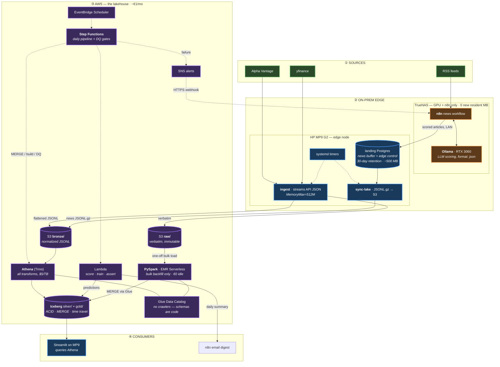

# AI_SP500 — Architecture v0.4 "Hybrid Lakehouse"

**Status:** target architecture · supersedes v0.3 "Lite"
**Date:** 2026-08-01
**Drivers:** (1) the TrueNAS node cannot absorb new resident memory or pool writes; (2) the project is now explicitly a **portfolio piece** demonstrating modern Data Engineering and MLOps patterns — Medallion architecture, lakehouse table formats, serverless orchestration, point-in-time ML.

---

## Table of Contents

- [0. Why v0.4 reverses v0.3 — and why that is not churn](#0-why-v04-reverses-v03--and-why-that-is-not-churn)
- [1. Verdict on the proposed four-stage design](#1-verdict-on-the-proposed-four-stage-design)
- [2. The architecture](#2-the-architecture)
- [3. Node and cloud roles](#3-node-and-cloud-roles)
- [4. Q1 — TrueNAS resource protection](#4-q1--truenas-resource-protection)
- [5. Q2 — Cloud tooling selection and cost](#5-q2--cloud-tooling-selection-and-cost)
- [5b. Where the lake, the catalog and Spark actually are](#5b-where-the-lake-the-catalog-and-spark-actually-are)
- [6. The medallion specification](#6-the-medallion-specification)
- [7. Orchestration — EventBridge + Step Functions](#7-orchestration--eventbridge--step-functions)
- [8. Q3 — Enterprise patterns at small scale](#8-q3--enterprise-patterns-at-small-scale)
- [9. ML and serving](#9-ml-and-serving)
- [10. Security](#10-security)
- [11. What carries over unchanged](#11-what-carries-over-unchanged)
- [12. Roadmap](#12-roadmap)
- [Appendix — version history](#appendix--version-history)

---

## 0. Why v0.4 reverses v0.3 — and why that is not churn

v0.3 concluded: *"This is not a lakehouse workload. Postgres is the entire warehouse."* That analysis was correct **for a pure-utility build**, and it has not been retracted — it is preserved as [ADR-001](docs/adr/ADR-001-lakehouse-for-small-data.md) and as the documented fallback.

What changed is the requirement. The project now has two goals of equal rank:

1. **Utility** — a working S&P 500 prediction pipeline under strict local constraints.
2. **Demonstration** — a repository that shows a hiring manager or reviewer real, hands-on fluency with the Medallion architecture, open table formats, serverless orchestration, and MLOps discipline.

Goal 2 cannot be met by a Postgres schema, however correct. It *can* be met without betraying goal 1, because at this data volume (~3.5 M rows backfilled, ~2 MB/day) a serverless lakehouse costs **~€1/month** — provided the tooling is chosen to avoid the four or five cloud cost traps documented in [§5](#5-q2--cloud-tooling-selection-and-cost).

The senior-engineer framing, stated openly in the repo: *"I know this data fits in Postgres. The lakehouse exists to demonstrate the patterns at production fidelity and near-zero cost — and the decision record proves I knew the difference."* That self-awareness is itself the strongest signal the portfolio can send.

---

## 1. Verdict on the proposed four-stage design

| # | Proposed | Verdict | What changed and why |
|---|---|---|---|
| 1 | Ingestion on-prem: Python/n8n + local LLM (RTX 3060) → local Postgres landing | **Keep, with one split** | LLM enrichment on the 3060 and n8n stay exactly as designed. But **market data never touches the local Postgres** — it streams straight to S3 (see below). Only the news feed lands locally, because it genuinely needs local processing (Ollama) before upload. The landing DB shrinks from "warehouse" to a **bounded 30-day buffer**. |
| 2 | Transport: periodic sync of local Postgres → S3 | **Keep, narrowed** | Sync applies to news + edge control tables only. Buffering *everything* through Postgres would double the write path for API data that is already JSON-shaped and add a failure mode for no benefit. |
| 3 | Lakehouse: "Databricks imitation" on S3 | **Keep, made concrete** | Not a micro-Databricks cluster (~€30–60/mo idle floor). The same patterns on open serverless equivalents: **S3 + Apache Iceberg + Glue Data Catalog + Athena**. Mapping table in [§5](#databricks--open-serverless-mapping). ~€1/mo. |
| 4 | ML & serving in cloud | **Keep, batch-only** | Weekly training (Lambda; SageMaker training job as the showcase option), daily batch scoring, predictions written back into a Gold Iceberg table. **No always-on SageMaker endpoint** — that alone would be ~€50+/mo for a daily prediction that a batch job serves for free. |

One structural addition the proposal did not name: an explicit **raw layer beneath bronze** (verbatim API responses, kept immutable — this already exists and already works), so the lakehouse can always be rebuilt from source bytes.

---

## 2. The architecture



### The one-sentence version

Capped edge jobs stream raw and normalized data to S3, a serverless Iceberg lakehouse (Glue + Athena) runs the Medallion transforms and data-quality gates under Step Functions, ML trains and scores in batch against snapshot-pinned Gold tables — and the TrueNAS contributes exactly two things it already runs: n8n and the GPU.

---

## 3. Node and cloud roles

| Where | Owns | Explicitly does not |
|---|---|---|
| **TrueNAS** | n8n news workflow, Ollama on the RTX 3060 | Any new resident service; any pipeline write to the ZFS pool; any AWS credential |
| **MP9 G2** | systemd timers, streaming ingest, landing Postgres (buffer, ≤1 GB RAM), sync + prune jobs, optional Streamlit | Warehouse duty (moved to the cloud in v0.4) |
| **AWS** | System of record (S3 raw), lakehouse (Iceberg + Glue + Athena), orchestration (EventBridge + Step Functions), batch ML (Lambda), alerting (SNS) | Anything always-on. Every cloud component is pay-per-request |
| **MacBook Air M1** | Notebooks against Athena, development | Anything scheduled |

**Failure behaviour.** MP9 down → ingestion pauses, watermarks resume it; the cloud pipeline still runs on whatever bronze holds. AWS unreachable → edge keeps buffering (news in landing PG, market data retries from watermark); nothing is lost. TrueNAS down → news enrichment pauses; market ingestion and the cloud pipeline are unaffected. No component can corrupt another's state.

**TrueNAS-only fallback.** If the MP9 is ever retired, the edge role fits on the TrueNAS at a cost of ~1 GB (capped landing PG + transient jobs) — acceptable only after the Phase-A cache reclamation in [`deploy/truenas/TUNING.md`](deploy/truenas/TUNING.md). The MP9 split remains strictly better.

---

## 4. Q1 — TrueNAS resource protection

Ranked by how much each mechanism protects the constrained node:

1. **The TrueNAS runs no new process at all.** The pipeline's on-prem footprint lives on the MP9. n8n and Ollama were already resident; their memory profile does not change. This is inherited from v0.3 and remains the strongest guarantee available — you cannot leak memory you never allocate.

2. **Zero pipeline bytes on the ZFS pool.** Market data streams from the API straight to S3 without touching local disk. News buffers on the MP9's SSD, not the pool. The 81%-full pool's only relationship to this project is that the project deliberately avoids it. (The pool still needs relief for its own sake — snapshot retention and media are the causes; see TUNING.md §4.)

3. **The landing Postgres is a buffer, not a warehouse — and it is bounded.** It holds: scored news awaiting sync, edge watermarks, and the edge ingestion log. A nightly `prune-landing` job deletes news rows that are both synced and older than 30 days, and log rows older than 90 days. Steady state is a few hundred MB, forever. Container cap: **1 GB** (down from 3 GB in v0.3 — the warehouse role left), `shared_buffers=256MB`.

4. **Streaming, capped, transient jobs.** One API response in memory at a time; flushed to S3 in ≤5 MB batches. Every systemd unit keeps its cgroup ceiling (`MemoryMax=512M` ingest, `256M` sync), `Nice=10`, `IOSchedulingClass=idle`. A leak is killed by the kernel, alerted through the existing `sp500-alert@` → n8n webhook, and resumed from watermark on the next timer.

5. **The cloud does all the heavy lifting.** Every join, window function, dedupe and DQ check runs in Athena. Local CPU cost of the entire transform layer: zero.

---

## 5. Q2 — Cloud tooling selection and cost

### The selection logic

At ~1 GB total and ~2 MB/day, the only cloud services that make sense are ones that **bill per request, not per hour**. Anything with an hourly floor — a cluster, an endpoint, a managed scheduler — costs more per month idling than this entire dataset costs to store for a decade.

**Chosen stack:** S3 + **Apache Iceberg** + Glue Data Catalog + **Athena** (engine v3 / Trino) + EventBridge Scheduler + **Step Functions** + Lambda + SNS.

Why Iceberg and not Delta: Athena **reads** Delta but can only **write and `MERGE`** Iceberg. Since Athena is the transform engine, Iceberg is the format — and it is the vendor-neutral choice besides. Recorded in [ADR-002](docs/adr/ADR-002-iceberg-over-delta.md).

Why Athena does the transforms and not Glue ETL or Lambda-Pandas: the transforms *are* SQL (MERGE, window functions, as-of joins). Athena runs them serverless at $5/TB scanned with a 10 MB per-query minimum — at this volume, effectively free — and `MERGE INTO`, time travel, `OPTIMIZE` and `VACUUM` on Iceberg are exactly the enterprise surface the portfolio should exercise.

### Databricks → open serverless mapping

The proposal said "Databricks imitation." Here is the explicit correspondence — useful in the README and in interviews:

| Databricks concept | This stack | Skill transfer |
|---|---|---|
| DBFS / cloud storage | **S3 `raw/` + `bronze/`** — the data lake itself | Immutable landing, replay boundary |
| Delta Lake tables | Apache Iceberg on S3 | ACID, MERGE, schema evolution, time travel — 1:1 |
| Unity Catalog | Glue Data Catalog (+ Lake Formation if row/column ACLs are ever needed) | Central metastore, table-level grants |
| Managed Spark clusters | Athena serverless SQL (Trino) for the daily path | Same SQL patterns, no cluster to size |
| Spark DataFrame jobs | **PySpark on EMR Serverless** for the bulk backfill ([ADR-004](docs/adr/ADR-004-spark-for-bulk-backfill.md)) | DataFrame API, Iceberg MERGE from Spark, compaction — €0 idle |
| Workflows / Jobs | EventBridge + Step Functions | DAGs, retries, failure routing |
| MLflow tracking | `ops.ml_runs` Iceberg table + S3 artifacts + model cards | Params/metrics/lineage, queryable in SQL |
| DBSQL dashboards | Streamlit querying Athena | — |
| Notebooks | Local Jupyter → Athena via `pyathena` | — |

(Databricks **Free Edition** is worth an account for UI literacy — but it is a sandbox, not an automation target.)

### Cost model (monthly, steady state)

| Service | Usage | Cost |
|---|---|---:|
| S3 (raw + bronze + iceberg + results, ~5 GB, versioned, Glacier IR after 90 d) | storage + requests | ~€0.15 |
| Athena | ~30 pipeline queries/day × 10 MB min + ad-hoc ≈ 15 GB scanned | ~€0.08 |
| Glue Data Catalog | ≪ free tier (1 M objects / 1 M requests) | €0 |
| Step Functions (standard) | ~700 transitions | €0 (4,000 free) |
| Lambda | ~100 invocations, small | €0 (free tier) |
| EventBridge Scheduler, SNS | trivial | €0 |
| EMR Serverless (backfill) | ~0 runs/month steady state; no pre-initialised capacity | **€0 idle**, a few cents per run |
| CloudWatch Logs (30-day retention) | ~1 GB | ~€0.30 |
| **Total** | | **~€0.60 — call it €1–2 with heavy ad-hoc querying** |

### Cost traps deliberately avoided

Each of these was considered and rejected — naming them in the repo is itself a FinOps demonstration:

| Trap | Idle floor | Replaced by |
|---|---|---|
| MWAA (managed Airflow) | **~€330+/mo** | Step Functions (free tier) |
| Micro-Databricks cluster | ~€30–60/mo | Athena + Iceberg |
| Glue Spark ETL **as the daily path** | 2-DPU floor on every run | Athena SQL; Lambda for imperative steps. (Spark is kept for the rare bulk backfill on EMR Serverless — [ADR-004](docs/adr/ADR-004-spark-for-bulk-backfill.md)) |
| Glue crawlers | ~€0.44/hr + nondeterminism | **Schemas are code**: DDL in git, partition projection for bronze |
| Redshift Serverless | ~€3+/hr when active (8-RPU floor) | Athena |
| SageMaker real-time endpoint | ~€50+/mo | Batch scoring Lambda → `gold.predictions` |
| Kinesis / MSK | ~€25+/mo | Nothing — there is no streaming requirement |
| QuickSight | €9+/user/mo | Streamlit on hardware already owned |

### Cost guardrails, enforced not hoped

- Athena workgroup with `bytes_scanned_cutoff_per_query = 1 GB` — a runaway query is killed by AWS, not discovered on an invoice.
- S3 lifecycle: raw → Glacier IR at 90 days; Athena results expire at 30 days; incomplete multipart uploads aborted at 7 days.
- CloudWatch log retention 30 days.
- An AWS Budget alarm at €5/mo wired to the same SNS → n8n alert path.

---

## 5b. Where the lake, the catalog and Spark actually are

The v0.1 diagram named three things by their vendor labels. All three still exist — two were
renamed, one was scoped down. Worth stating plainly, because "we dropped it" and "we renamed
it" are very different claims.

### The data lake — present, and it is the bottom of the same bucket

"Lakehouse" is not a replacement for a data lake; it is a **data lake plus three things**:

```
  data lake      S3 raw/   (verbatim API bytes, immutable, delete-denied)
               + S3 bronze/ (normalized JSONL, append-only)
  + table format   Apache Iceberg      -> ACID, MERGE, schema evolution, time travel
  + catalog        Glue Data Catalog   -> one metastore for every engine
  + engine         Athena (Trino)      -> serverless SQL
  ───────────────────────────────────────────────────────────────────
  = lakehouse
```

`raw/` and `bronze/` **are** the data lake, and they are the system of record: every Iceberg
table above them is a derived artifact, rebuildable by replay. Nothing was removed — the
lake gained the three properties that make a warehouse trustworthy.

### Unity Catalog → Glue Data Catalog

Same role: the central metastore that lets multiple engines agree on what a table is. In this
build, Athena **and** Spark both commit through Glue, which is precisely why a Spark backfill
and an Athena daily MERGE write one table with one schema rather than two views of it.

What Unity Catalog has that Glue does not, and whether it matters here:

| Unity Catalog capability | Glue equivalent | Matters at one user? |
|---|---|---|
| Central metastore, schema registry | Glue Data Catalog | Present |
| Table/database-level grants | IAM policies | Present |
| Row- and column-level ACLs, data masking | **AWS Lake Formation** (layers on Glue) | No — one principal. Add Lake Formation if a multi-user governance story is wanted |
| Automated column-level lineage UI | none | No — lineage here is explicit and stronger: `ops.ml_runs` pins the Iceberg **snapshot ID** |
| Managed volumes, notebooks, model registry | S3 + local Jupyter + `ops.ml_runs` | No |
| Cross-workspace / multi-cloud federation | none | No |

Glue is the metastore; Lake Formation is the governance layer if it is ever needed. That
split is the AWS-native shape of what Databricks bundles into one product.

### Spark — removed from the daily path, restored where it wins

This was a genuine gap, not a rename. [ADR-003](docs/adr/ADR-003-serverless-over-cluster.md)
rejected Spark on the idle-floor test, and that reasoning still holds for the 2 MB daily
increment. But rejecting it *everywhere* cost something real: PySpark is the single most
frequently listed skill in data-engineering postings, and "I used a distributed SQL engine"
does not answer "have you written Spark?"

[ADR-004](docs/adr/ADR-004-spark-for-bulk-backfill.md) restores it for the one workload that
is genuinely Spark-shaped:

| | Daily increment | Historical backfill |
|---|---|---|
| Volume | ~2 MB, ~1 K rows | Entire `raw/` archive — tens of thousands of small gzipped JSON files |
| Shape | Already-flat rows | Dynamic map keyed by date; Athena's JSON SerDe needs a static column per key |
| Cadence | Every day | Initial load + after a parsing change |
| Engine | **Athena SQL** | **PySpark on EMR Serverless** |
| Cost | ~€0.08/mo | a few cents per run, **€0 idle** |

The split — **bulk historical load on Spark, incremental merge on SQL** — is what production
systems actually do, so it is defensible on its merits rather than as a résumé gesture.

[`jobs/spark/backfill_prices.py`](jobs/spark/backfill_prices.py) exercises the DataFrame API,
window-function deduplication, `MERGE INTO` on Iceberg **from Spark**, and
`rewrite_data_files` compaction. It is vanilla OSS Spark, so the file runs unmodified
locally, on EMR, or on Databricks. EMR Serverless is configured with **no pre-initialised
capacity**, which is what keeps the idle cost at zero — see
[`infra/terraform/spark.tf`](infra/terraform/spark.tf).

---

## 6. The medallion specification

### Layers

| Layer | Format | Location | Contract |
|---|---|---|---|
| **raw** | Verbatim API responses (JSON), gzip | `s3://<lake>/raw/<feed>/<function>/dt=YYYY-MM-DD/` | Immutable, append-only, never queried in the hot path. The replay boundary — the entire lakehouse is rebuildable from here. Uploader IAM is **denied `s3:DeleteObject`**. |
| **bronze** | Normalized JSONL.gz — one record per line, untyped strings | `s3://<lake>/bronze/<table>/dt=YYYY-MM-DD/` | Append-only. External Athena tables via JsonSerDe + **partition projection** (no crawlers, no `MSCK`). Schema-on-read; typing is silver's job. |
| **silver** | **Iceberg** | `s3://<lake>/silver/` | Typed, deduplicated, conformed. Idempotent `MERGE` on natural keys. Vintage columns preserved (`fetched_at`, `published_at`/`ingested_at`). |
| **gold** | **Iceberg** | `s3://<lake>/gold/` | `features_daily` (with `feature_asof`), `labels` (separate table, forward-looking by design), `predictions`. The only layer ML reads. |
| **ops** | Iceberg | `s3://<lake>/ops/` | `pipeline_runs`, `dq_results`, `ml_runs` — the audit trail. |

### Partitioning at small scale — a deliberate judgment call

Daily partitions on silver/gold Iceberg tables would manufacture a small-files problem out of nothing (hundreds of KB-sized files per year per table). Therefore:

- **bronze**: partitioned by `dt` (natural for append + projection).
- **silver/gold**: Iceberg hidden partitioning by **`month(trade_date)`** on prices/features; **unpartitioned** for small tables (macro, news, commodities). Weekly `OPTIMIZE … REWRITE DATA USING BIN_PACK` + `VACUUM` keep files healthy.

Being able to explain *why coarse partitioning is correct here* is worth more in review than reflexively partitioning by day.

### Schemas

DDL lives in [`sql/athena/`](sql/athena/) — schemas are code, applied via CI or `make athena-apply`, never inferred by crawlers. Column-level design (vintage columns, dual news timestamps, `feature_asof`) carries over from v0.3's [`sql/001_schema.sql`](sql/001_schema.sql) unchanged in meaning; that file remains in force for the **landing** Postgres (apply the `platform` schema + `silver.news` as the buffer table).

---

## 7. Orchestration — EventBridge + Step Functions

### Daily state machine (07:00 UTC, after the 06:15 edge ingest and 06:35 sync)

```
MERGE silver.prices  →  MERGE silver.news  →  DQ-silver gate  →
build gold.features  →  build gold.labels  →  DQ-gold gate (incl. lookahead)  →
score (Lambda)  →  publish summary
     any failure ──► SNS ──► n8n webhook ──► existing alert flow
```

Definition: [`infra/stepfunctions/daily_pipeline.asl.json`](infra/stepfunctions/daily_pipeline.asl.json). Design choices worth defending:

- **Native Athena integration** (`startQueryExecution.sync`) — no Lambda in the transform path at all. The state machine console shows every SQL step's status directly.
- **DQ gates are states, not afterthoughts.** Each gate runs the check suite (which also `INSERT`s its results into `ops.dq_results` for the audit trail), reads the violation count via `getQueryResults`, and a `Choice` state fails the execution if it is non-zero. Quality failure halts promotion — silver never reaches gold on a red check.
- **Parameterized by `run_date`** (defaults to execution date). Re-running any date is safe end-to-end because every write is a MERGE or a deterministic overwrite — this is the idempotency demonstration, executable on demand.
- **Retries with backoff** on every Athena state; a single `Catch` route to SNS.
- Weekly machines: `train` (Sunday, after the Saturday backfill) and `maintenance` (`OPTIMIZE`/`VACUUM` on all Iceberg tables).

### Why not Airflow-in-cloud

MWAA's floor is ~€330/month — 300× the rest of the stack combined. Step Functions gives DAGs, retries, parameterized backfill and a visual console within the free tier. The v0.3 argument against local Airflow (resident memory) and the v0.4 argument against managed Airflow (idle cost) bracket the same conclusion from both sides. Recorded in [ADR-003](docs/adr/ADR-003-serverless-over-cluster.md).

### Hybrid alerting

One path for everything: systemd `OnFailure=` (edge) and SNS (cloud) both terminate at the existing n8n webhook → your existing notification flow. SNS delivers to n8n via an HTTPS subscription. One place to look, on hardware you already run.

---

## 8. Q3 — Enterprise patterns at small scale

The volume is small; the patterns are real. Each row names where the pattern is executable in this repo — the table doubles as the portfolio README's skills index:

| Pattern | Where it lives | The interview sentence |
|---|---|---|
| **Idempotent ingestion** | Deterministic S3 keys (`dt=…/run_id`); watermark-driven fetch | "Re-running any day is a no-op, not a duplicate." |
| **Idempotent transforms** | Iceberg `MERGE INTO` on natural keys, everywhere | "Replay is the recovery strategy, so replay is the write path." |
| **Point-in-time correctness** | Vintage columns (`fetched_at` on fundamentals/macro), dual news timestamps, `feature_asof`, as-of joins in [`gold_build_features.sql`](sql/athena/prepared/gold_build_features.sql) | "Restated GDP and late-scraped news can't leak into training rows." |
| **Lookahead as a hard failure** | DQ check `gold_no_lookahead` fails the state machine | "The pipeline refuses to publish a leaking feature set." |
| **Data quality gates between layers** | [`prepared/dq_*.sql`](sql/athena/prepared/dq_gold_record.sql) + Choice states; results audited in `ops.dq_results` | "Quality checks gate promotion and leave an audit trail." |
| **Model–data lineage** | `ops.ml_runs` records the **Iceberg snapshot ID** of gold at training time | "Every model is reproducible against the exact table version it saw — that's time travel doing MLOps work." |
| **Schemas as code** | DDL in git; partition projection; zero crawlers | "Schema changes are pull requests, not runtime surprises." |
| **Immutable raw + replay** | `raw/` verbatim, versioned, delete-denied | "The lakehouse is a derived artifact; source bytes are the system of record." |
| **Distributed processing** | [`jobs/spark/backfill_prices.py`](jobs/spark/backfill_prices.py) on EMR Serverless | "Bulk historical load on Spark, incremental merge on SQL — each engine where it wins." |
| **IaC** | [`infra/terraform/`](infra/terraform/) — bucket, lifecycle, catalog, workgroup, IAM, SNS, scheduler, state machine | "The whole cloud footprint is `terraform apply`." |
| **Least privilege** | Edge uploader can `PutObject` to two prefixes and nothing else; deny-delete on raw; per-role policies | — |
| **FinOps** | Cost model + traps table in this doc; `bytes_scanned_cutoff`; budget alarm | "Cost ceilings are enforced by config, not intentions." |
| **Decision records** | [`docs/adr/`](docs/adr/) | "I can show you why, not just what." |
| **Table maintenance** | Weekly `OPTIMIZE`/`VACUUM` machine; snapshot retention properties | — |
| **CI/CD** *(Phase 6)* | GitHub Actions: ruff, pytest, `terraform validate`, SQL dry-run | — |

Deliberately deferred, each with its trigger: **dbt-athena** (adopt when the SQL model count passes ~10 — it would showcase dbt but doubles the toolchain before the pipeline exists), **Great Expectations** (when hand-written SQL checks stop being manageable), **Lake Formation** fine-grained grants (multi-user access), **SageMaker Pipelines** (when training outgrows a Lambda).

---

## 9. ML and serving

- **Training** — weekly, walk-forward with embargo (unchanged discipline from v0.2/v0.3: score the ~53% naive baseline first, `TimeSeriesSplit`, never a random split). Runs in a Lambda (10 GB RAM ceiling is ample for XGBoost on 2.6 M rows; trains in seconds). The **SageMaker training job** variant costs ~€0.02/run on `ml.m5.large` and is the résumé-visible option — either way, no endpoint.
- **Tracking** — every run inserts into `ops.ml_runs`: params, metrics, feature list, train/test windows, embargo days, git SHA, artifact S3 URI, and the **gold snapshot ID**. A model card (`card.md`) accompanies each artifact.
- **Scoring** — daily Lambda in the state machine: query the latest gold row via Athena, predict, `MERGE` into `gold.predictions`, post the summary to the n8n digest webhook.
- **Serving** — Streamlit on the MP9 querying Athena with result caching (Athena's query-result reuse makes repeated dashboard loads cost one scan), plus the n8n email digest you already receive. No always-on cloud serving.

---

## 10. Security

- **Blast-radius split**: only the MP9 holds AWS credentials — a single IAM principal scoped to `PutObject` on `raw/*` and `bronze/*`, `ListBucket` on those prefixes, and an explicit **deny on delete**. The TrueNAS (and n8n) never touches AWS; alerts flow *inbound* via webhook. Upgrade path: IAM Roles Anywhere (X.509) to eliminate the long-lived key.
- Bucket: public-access-block on all four settings, SSE-S3, versioning on `raw/`.
- Cloud roles (Step Functions, Lambda, Scheduler) each get a minimal inline policy — no `*` actions.
- Secrets on the edge stay in `/opt/ai_sp500/.env` (mode 600), as in v0.3.

---

## 11. What carries over unchanged

- **All eleven catalogued code defects** and their fixes ([README § Known Issues](README.md#known-issues)) — Phase C is unchanged.
- **The ingestion budget**: `entity_level` on index-level endpoints (−10,710 calls), technicals computed not fetched (−26,061 calls — now in Athena SQL), cadence via watermarks. ~44,968 → ~2,500 calls/week.
- **TrueNAS memory reclamation** ([`deploy/truenas/TUNING.md`](deploy/truenas/TUNING.md)) — still the single biggest node-health win, still independent of the pipeline.
- **Local LLM discipline**: pinned model + prompt hash on every news row; switch to Ollama *before* backfilling.
- **Point-in-time rules** and the naive-baseline-first evaluation ethic.
- **systemd edge units** — same mechanism; stages become `ingest-daily`, `ingest-weekly`, `sync-lake`, `prune-landing` (gold-build and train move to the cloud).

---

## 12. Roadmap

| Phase | Work | Exit criterion |
|---|---|---|
| **A. Reclaim TrueNAS RAM** *(unchanged)* | ARC + WiredTiger caps; migrate 3 stateless UIs | >4 GB available; ARC hit ratio >85% |
| **B. Cloud foundation** | `terraform apply`; bronze DDL via `make athena-apply` | Athena queries an empty lakehouse; budget alarm armed |
| **C. Fix ingestion defects** *(unchanged)* | The eleven known issues | Every script completes a pass |
| **D. Edge rebuild** | Streaming ingest → raw+bronze; landing PG as buffer; sync + prune units | A day of market data queryable in Athena bronze; ZFS pool untouched |
| **E. Silver + DQ + orchestration** | MERGEs, DQ suite, state machine live | Daily run green in the SFN console; red DQ blocks gold |
| **F. Gold + lookahead** | Features, labels, as-of joins, technicals in SQL | `gold_no_lookahead` passes; features queryable |
| **G. News + LLM** | Ollama scoring, sync path, news features | `silver.news` in the lakehouse with model provenance |
| **H. ML** | Baseline → logistic → XGBoost; `ops.ml_runs` with snapshot IDs; scoring in the DAG | A model beats the naive baseline out-of-sample; predictions land daily |
| **I. Portfolio polish** | Streamlit, CI, model cards, ADR pass, README skills index | A stranger can evaluate the repo in ten minutes |

---

## Appendix — version history

| Concern | v0.1 | v0.2 | v0.3 "Lite" | **v0.4 "Hybrid Lakehouse"** |
|---|---|---|---|---|
| Goal | Utility | Utility | Utility under hardware limits | **Utility + skills demonstration** |
| Warehouse | Aurora | TrueNAS Postgres | MP9 Postgres | **Iceberg on S3** |
| Transform engine | Spark/EC2 | DuckDB | Postgres SQL | **Athena (Trino) SQL** + **PySpark/EMR Serverless** for bulk backfill |
| Orchestration | Airflow/EC2 | Airflow/TrueNAS | systemd + n8n | **EventBridge + Step Functions** (edge: systemd) |
| Catalog | Unity | — | — | **Glue Data Catalog** |
| Experiment tracking | — | MLflow | Postgres table | **`ops.ml_runs` Iceberg + snapshot lineage** |
| LLM | cloud | cloud | local Ollama | local Ollama |
| New RAM on TrueNAS | n/a | 4–8 GB ✗ | 0 | **0** |
| New ZFS writes | n/a | growing ✗ | 0 | **0** |
| Cloud cost | ~€150/mo | ~€0.50/mo | ~€0.50/mo | **~€1–2/mo** |
| IaC / CI / ADRs | — | — | — | **Terraform · Actions · ADRs** |
