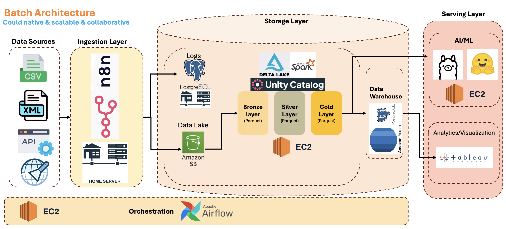

# AI_SP500: A Personal Data Platform for S&P 500 Analysis

**AI_SP500** is a personal, experimental research project designed to collect, process, and analyze economic and financial data that influence the S&P 500. The goal is to build a lean, efficient, and scalable system capable of producing meaningful insights and predictive signals about the market's future behavior, all while operating on a minimal budget.

This project is built to run on a hybrid infrastructure, leveraging a modest home server for ingestion and light processing, and low-cost or free-tier AWS services for storage and more intensive computation.

## High-Level Architecture

The system follows a modern data platform architecture, divided into distinct layers for ingestion, storage, processing, and serving. The architecture is designed to be simple, maintainable, and cost-effective, balancing local and cloud resources.

For a visual representation of the architecture, please see the diagram below (derived from the `InfaArquitecture_V0.1.png` file).

### End-to-End Workflow

1.  **Ingestion:** Data from various sources (APIs, web scraping) is collected using scheduled jobs. This layer is designed to run primarily on a home server to minimize costs.
2.  **Storage:** Raw data is stored in a Bronze layer in an AWS S3 data lake. After cleaning and transformation, it moves to Silver (structured) and Gold (aggregated) layers. This layered approach ensures data quality and versioning. PostgreSQL is used for metadata and logging.
3.  **Processing:** Data is processed and transformed using lightweight compute resources. This can be done locally on a home server or on small, on-demand EC2 instances for more significant workloads. Airflow is used for orchestrating these data pipelines.
4.  **Serving:** The final, processed data and model outputs are served through dashboards and APIs. This allows for visualization of trends, correlations, and model predictions.

## Current Progress

The project is currently focused on building a robust and observable **ingestion and storage layer**. The core data pipeline is now functional.

**Key Features & Achievements:**

*   **Automated Data Ingestion:** The main pipeline (`DataIngestion_&_BronzeLayer/getRequester.py`) automatically fetches financial data from the Alpha Vantage API. It dynamically reads a list of S&P 500 tickers and a set of API functions from local configuration files (`sp500_tickers.csv`, `alpha_vantage_urls.json`), making the ingestion process easily extensible.
*   **S3 Data Lake (Bronze Layer):** All ingested raw data is uploaded to an AWS S3 bucket, establishing the "Bronze" layer of our data lake. The data is organized into folders based on its source API category (e.g., `raw/Core_Stock_APIs/`).
*   **Database Logging:** A comprehensive logging system has been implemented. The outcome of every ingestion attempt (success or failure) is recorded in a PostgreSQL database (`s3_ingestion_logger` table). This log captures the API function, stock symbol, S3 object path, file size in bytes, and a detailed status message.
*   **Configuration Management:** The project securely manages secrets and environment-specific settings (like API keys and credentials for AWS and PostgreSQL) using a `.env` file, which is kept out of version control.
*   **Structured Project Layout:** The codebase is organized into Python packages (`Helper_Functions`, `DataIngestion_&_BronzeLayer`), ensuring modularity and maintainable imports.
*   **Dependency Management:** Project dependencies are managed with Poetry, with all required libraries defined in the `pyproject.toml` file.
*   **Database Schema:** A foundational SQL schema has been defined (`DataIngestion_&_BronzeLayer/create_table.sql`) to store the ingested financial data in a structured relational format, with tables for both metadata and time-series data points.

## Planned Roadmap

The following phases outline the future development of the project:

1.  **Bronze to Silver Layer:** Implement data cleaning, normalization, and transformation pipelines to move data from the Bronze (raw) to the Silver (structured) layer in the S3 data lake.
2.  **Silver to Gold Layer:** Develop aggregation and feature engineering pipelines to create the Gold layer, which will serve as the source for analytics and machine learning models.
3.  **Model Development:** Build and train predictive models (e.g., XGBoost, LSTM) to forecast S&P 500 movements, predict volatility, and classify market regimes.
4.  **Serving Layer:** Create a serving layer with dashboards (e.g., using Streamlit or Plotly) to visualize insights, trends, and model predictions.
5.  **CI/CD and Automation:** Implement CI/CD pipelines to automate testing and deployment of the data pipelines and models.

## Technologies Used

*   **Data Ingestion:** Python (`requests`, `yfinance`, `alpha_vantage`)
*   **Orchestration:** Apache Airflow
*   **Data Storage:** AWS S3, PostgreSQL
*   **Data Processing:** Python, Pandas (with plans for Spark on EC2 for larger workloads)
*   **Serving/Visualization:** (Planned) Streamlit, Plotly, Tableau Public
*   **Infrastructure:** Docker, AWS (S3, EC2, Aurora)

## Installation and Setup

*(This section is a placeholder and will be updated as the project matures.)*

Instructions on how to set up the environment, install dependencies, and run the project will be provided here.
