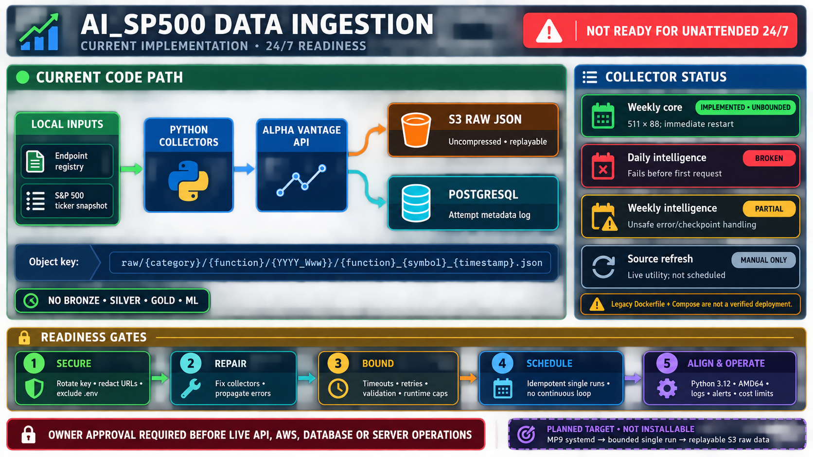

# Data ingestion — current implementation

> **Status:** Designed for server-hosted ingestion, but not currently approved for
> unattended 24/7 operation. The existing collectors make live API, AWS and PostgreSQL
> calls and must pass the readiness gates below before deployment.



*Current implementation and the gates required before unattended operation.*

## Purpose and flow

[`DataIngestion/`](../DataIngestion/) is the implemented Alpha Vantage extraction layer. It:

1. reads endpoint definitions and the S&P 500 ticker snapshot from
   [`DataIngestion/Data/`](../DataIngestion/Data/);
2. requests source payloads and preserves them as uncompressed raw JSON in S3;
3. attempts to record request and object metadata in PostgreSQL.

It does not create normalized Bronze, Silver or Gold tables, and it does not train or score
models.

```text
Endpoint registry + ticker snapshot
                |
                v
Python collector -> Alpha Vantage -> S3 raw JSON
                                  -> PostgreSQL attempt log
```

S3 objects follow this pattern:

```text
raw/<category>/<function>/<YYYY_Www>/<function>_<symbol>_<timestamp>.json
```

Daily intelligence objects omit the symbol. Log records use the
[`s3_ingestion_logger`](../DataIngestion/Logs_OLTP/ddl_queries.sql) table.

## Entry points

| Program | Intended role | Current status |
|---|---|---|
| [`getRequesterWeekly.py`](../DataIngestion/getRequesterWeekly.py) | Core, fundamental, commodity, economic and technical data | Implemented, but its 511 × 88 request loop is unbounded and restarts immediately |
| [`getRequesterDailyAI.py`](../DataIngestion/getRequesterDailyAI.py) | News sentiment and market movers | Broken before its first protected request |
| [`getRequesterWeeklyAI.py`](../DataIngestion/getRequesterWeeklyAI.py) | Transcripts, insider transactions and analytics | Partial; error and checkpoint behaviour can mark incomplete work as processed |
| [`API_GeneralListCollector.py`](../DataIngestion/API_GeneralListCollector.py) | Refresh source/ticker files | Manual utility; makes live external requests and is not a scheduled ingestion job |

HTTP, S3 and logging helpers live in
[`Helper_Functions/`](../DataIngestion/Helper_Functions/). The Dockerfile and Compose file
are legacy packaging assets, not a verified server deployment.

## Runtime configuration

Supply secrets through an approved runtime secret mechanism. The code can load an untracked
`DataIngestion/.env` file for local development, but values must never be committed, logged or
copied into an image.

| Area | Environment-variable references |
|---|---|
| Alpha Vantage | `ALPHA_VANTAGE_API_KEY` |
| S3 | `REGION_NAME`, `BUCKET_NAME`, `S3_ACCESS_KEY`, `S3_SECRET_ACCESS_KEY` |
| PostgreSQL | `POSTGRES_HOST`, `POSTGRES_PORT`, `POSTGRES_DB`, `POSTGRES_USER`, `POSTGRES_PASSWORD` |
| Ticker refresh only | `API_NINJA` |

## Readiness gates for 24/7 operation

Do not start or publish the current collectors until all of these are complete:

- rotate the exposed API credential, stop full-URL logging and exclude `.env` from the
  Docker build context;
- fix the daily and weekly-intelligence failures and propagate S3/logging errors correctly;
- add request timeouts, bounded retries, response validation and explicit call/runtime caps;
- replace the continuous loop with scheduler-controlled, idempotent single runs;
- refresh the stale dependency lock, then rebuild an AMD64 image aligned with Python 3.12;
- initialise and verify PostgreSQL logging, health alerts, retention and cost limits;
- obtain owner approval before any live API, AWS, database or server operation.

The target is a bounded MP9 systemd ingestion service with replayable S3 raw data. That
runtime remains planned and is not currently installable from this repository.

## Related documentation

- [Current repository state](../README.md#current-state)
- [Confirmed ingestion issues](../README.md#known-issues)
- [Target hybrid architecture](../ARCHITECTURE.md#2-the-architecture)
- [Target edge design — not currently installable](../deploy/README.md)
